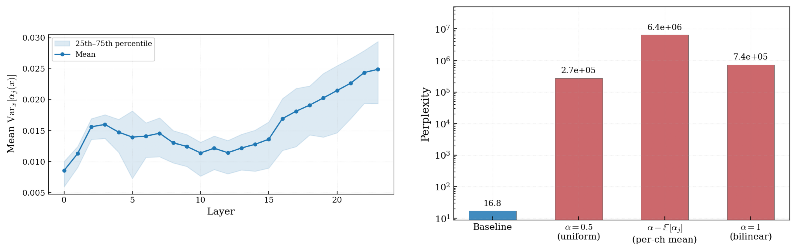
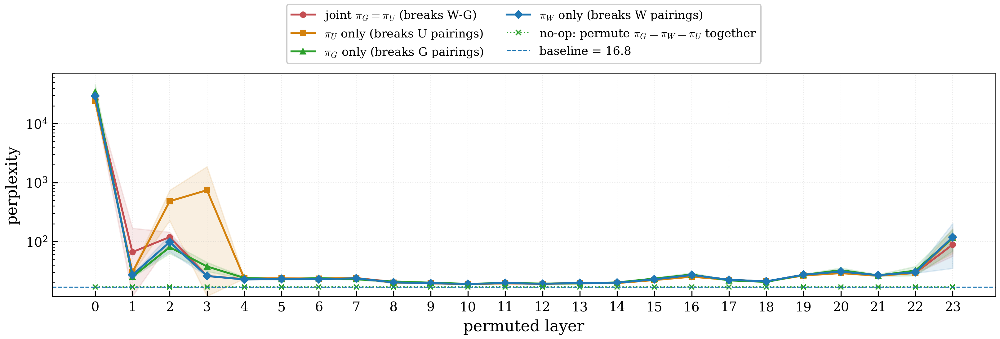
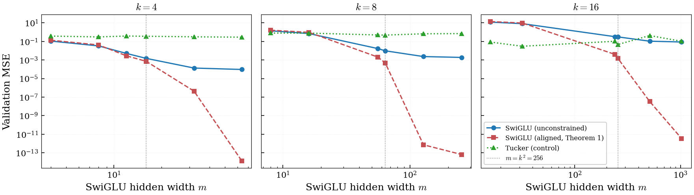
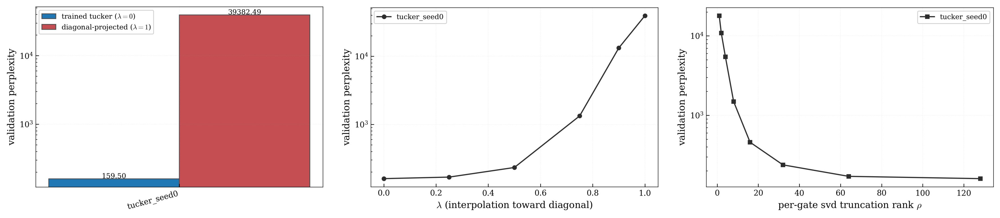
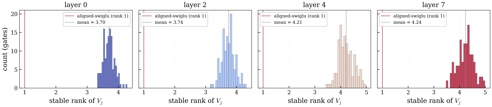
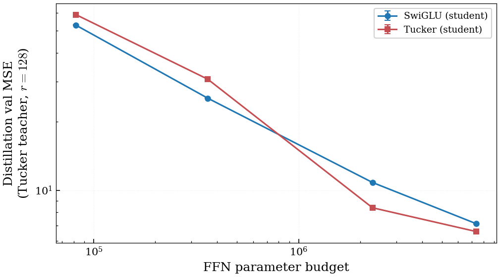
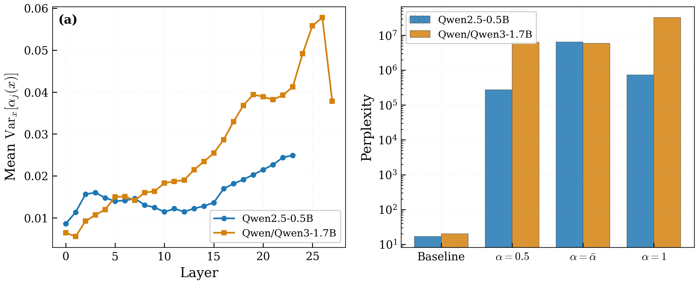

# Numerical results summary

Paper-flow walkthrough: each section names the claim it makes, shows the figure
it makes the claim with, and lists the numerical evidence underneath.

The five main-text figures and three appendix figures live as PNGs at
`results/figures/` with matching `\includegraphics` `.tex` stubs at
`results/figures/fig_*.tex`.

**Main-text figures**

1. `fig_routing_validation` — §3
2. `fig_synthetic_fitting`  — §5.1
3. `fig_diagonal_projection` — §5.2
4. `fig_stable_rank_histogram` — §5.2
5. `fig_tucker_teacher_distillation` — §5.3

**Appendix figures**

- A1. `fig_pairing_permutation` — §3 supplementary (same-index coupling)
- A2. `fig_lm_loss_curves`     — §5.4 supplementary (loss curves over time)
- A3. `fig_robustness_panel`    — robustness across model families

---

## §3 Routed-CP framework — validation on Qwen2.5-0.5B (Figure 1)

> **Claim.** SwiGLU's routing coefficients α_j(x) = σ(g_j^T x) are not approximately
> constant in trained models, and replacing them with constants destroys the model.

_source: `results/qwen25_05b/{routing_stats.npz, ablation_results.json}` →
fig assembled from `experiments/exp02_routing_stats.py` + `experiments/exp04_routing_ablation.py`._

- **(left)** per-layer mean Var_x[α_j(x)] across 24 SwiGLU layers — U-shaped: low in middle layers, sharp rise into the final layers.
- **(right)** constant-α replacement perplexity on a 4096-token chunk of WikiText-2:
  - baseline (full routing): **16.84**
  - α = 0.5 (uniform): **272,372**
  - α = 1 (pure bilinear): **737,666**
  - α = E[α_j] (per-channel mean): **6,412,058**

All three constant-α replacements destroy the model by 4–6 orders of magnitude. Justifies the routed-CP form `A(x) = Σ_j α_j(x) u_j ⊗ w_j ⊗ g_j` as the right structural object.

---

## §3 Same-index pairing is binding (Appendix A1)

> **Claim.** The same-index coupling among (W, G, U) is non-trivial: random
> single-factor permutation of a SwiGLU layer is layer-dependent — early
> layers degrade by 3–4 orders of magnitude in perplexity, middle layers by
> only ~10–50%, and the no-op control of permuting all three together with
> the same π is exactly baseline. The asymmetry shows the binding strength
> varies with depth, but the no-op control rules out a permutation-of-units
> artifact.

_source: `results/qwen25_05b/pairing_permutation.json` (8 seeds × 24 layers × 4
conds) + `noop_control.json` (4 seeds × 24 layers, exp09b). 4-condition
overlay: joint π_G=π_U breaks W–G; π_U-only breaks U-pairing; π_G-only and
π_W-only break the matching coupling. No-op (g+u+w joint π) overlays exactly
on the baseline (16.84) line at every layer._

| condition | mean ppl | max (layer 0) | min (layer 10) | layer-10 ratio |
|---|---|---|---|---|
| baseline | 16.84 | — | — | 1.00× |
| **joint** π_G=π_U (breaks W–G) | 1100 | 25,600 | 18.9 | 1.12× |
| **u_only** (breaks U pairings) | 1100 | 24,500 | 18.8 | 1.12× |
| **g_only** (breaks G pairings) | 1470 | 34,600 | 19.1 | 1.13× |
| **w_only** (breaks W pairings) | 1250 | 29,400 | 19.0 | 1.13× |
| **no-op** (g+u+w joint π) | 16.84 (max dev 7.6e-6) | — | — | 1.00× |

This figure is supplementary (appendix); the main text references the
geomean(joint/u_only) ratio of 0.846 and the no-op control as a one-line
sanity check.

---

## §5.1 Synthetic separation experiment — Theorem 1 verified (Figure 2, headline)

> **Claim.** A SwiGLU constrained to the matched-coordinates hypothesis class
> shows the predicted knee at m = k² when fitting a generic Tucker(d,r=s=k)
> teacher. Aligned-SwiGLU drops to machine precision at m ≥ 2k² and fails
> below m = k². Unconstrained SwiGLU plateaus far above machine precision
> across the same range.

_source: `results/exp10/synthetic_fitting.npz` (d=64, k ∈ {4, 8, 16}, 3 seeds,
4000 Adam steps with cosine schedule). Three panels k=4, 8, 16; vertical
dotted line marks m = k²._

- k=4 (knee at m=16): aligned-SwiGLU val MSE drops 4.18e-2 (m=8) → 2.80e-3 (m=12) → 7.10e-4 (m=16) → **1.32e-14 (m=64)**; unconstrained plateaus at 9.5e-5.
- k=8 (knee at m=64): aligned 9.57e-1 (m=16) → 4.74e-4 (m=64) → **6.38e-14 (m=256)**; unconstrained plateaus at 1.9e-3.
- k=16 (knee at m=256): aligned 9.68 (m=32) → 1.49e-3 (m=256) → **3.44e-12 (m=1024)**; unconstrained plateaus at 8.7e-2.

**SVD construction (★ markers at m = k²)**: an analytic aligned-SwiGLU constructed by SVD-decomposing each V_j = R C^(j) into rank-ρ_j ≤ k SVD terms (no training) lands at:
- k=4, m=16: **2.5e-14**
- k=8, m=64: **1.9e-13**
- k=16, m=256: **1.4e-12**

This verifies the Theorem 4.2 upper bound is attained without optimization (the trained aligned-SwiGLU at m=k² has not yet converged to the SVD construction, but the analytic construction shows the bound is tight).

This is the most direct empirical verification of Theorem 1.

---

## §5.2 Diagonal-bottleneck cost on a trained Tucker LM (Figure 3)

> **Claim.** Forcing a trained Tucker layer's core C onto its superdiagonal —
> the SwiGLU recovery condition — costs **518× perplexity** at matched
> parameter count. Per-gate SVD truncation traces the full curve predicted by
> Theorem 1 from rank ρ=1 (aligned-SwiGLU width m=r) through ρ=128 (full Tucker).

_source: `results/exp13_hc_v3/results.json` (hill-climbed Tucker LM trained on
100M FineWeb-Edu tokens, evaluated on a 64-sequence held-out FineWeb-Edu val
set). 2-panel: λ-sweep interpolates C → diag(C); ρ-sweep replaces V_j = R C^(j)
by its rank-ρ SVD truncation gate-by-gate (log-ρ axis). Baseline preservation
check at ρ=128 passes at 0.002% rel_err. The headline 518× number lives in
the caption / prose — the dose-response and rank-truncation curves carry the
load._

- **headline:** trained ppl **111.84** vs fully-diagonal projected **57,975** = **518× cost** at λ=1.
- **dose-response (left):** smooth blow-up with λ — λ=0.50 ppl 172, λ=0.75 ppl 901, λ=0.90 ppl 11,165, λ=1.0 ppl 57,975.
- **rank-truncation (right):** ρ=1 ppl 41,546 → ρ=8 ppl 667 → ρ=32 ppl 136 → ρ=128 ppl 111.84. The crisp 1-to-128 descent traces "aligned-SwiGLU width m=ρ·r" perplexity on a log-ρ axis.

---

## §5.2 Stable rank confirms cross-channel exploitation (Figure 4)

> **Claim.** Trained Tucker layers V_j = R C^(j) have stable rank well
> above 1 in every gate, so the model genuinely exploits cross-channel
> structure that an aligned SwiGLU at width r cannot represent.

_source: `results/exp12_hc_v3/stable_rank.npz` (hc v3 trained Tucker, 8 layers
× 128 gates). Histograms of stable rank ‖V_j‖_F² / ‖V_j‖_op² across gates,
faceted by layer. Vertical red line marks the rank-1 ceiling that an aligned
SwiGLU at width r would impose._

| run | mean stable rank | min | max |
|---|---|---|---|
| default-init tucker (exp11) | 27.56 | 22.01 | 31.42 |
| hc v1 (`diagonal_bias_init`, legacy scaling) | 16.80 | 8.21 | 23.02 |
| hc v2 (v1 + 2× core LR) | 15.17 | 7.15 | 20.70 |
| **hc v3 (corrected init, paper variant)** | **3.97** | 2.79 | 5.30 |

All four runs land well above the rank-1 ceiling that Theorem 1 imposes on
aligned-SwiGLU at width r. The corrected variance-preserving warm start
(hc v3 — the paper variant, consistent with §5.4) keeps the model close to
diagonal while still using ~4× the rank-1 ceiling. Default-init uses the most
rank but pays a 30% perplexity penalty (see §5.4).

---

## §5.3 Distillation gap — Tucker beats SwiGLU at scale (Figure 5)

> **Claim.** When the teacher is a trained Tucker layer, a Tucker student
> outperforms a parameter-matched SwiGLU student at sufficient budget. There
> is a clean crossover: SwiGLU wins at small budgets (optimization wins),
> Tucker wins at large budgets (expressivity wins).

_source: `results/exp14b/tucker_teacher_distillation.json` (teacher = layer 4
of trained Tucker LM; 4 budgets, 3 seeds each, 8000 Adam steps with cosine
schedule)._

| budget | swiglu m | tucker r=s | swiglu val_mse | tucker val_mse | ratio (sw/tk) |
|---|---|---|---|---|---|
| ~80k params  | 53   | 32  | 5.29e+01 | 5.89e+01 | 0.90× |
| ~360k params | 235  | 64  | 2.53e+01 | 3.07e+01 | 0.83× |
| **~2.3M params (matched LM config)** | **1493** | **128** | **1.08e+01** | **8.38e+00** | **1.29×** |
| ~7.4M params | 4800 | 192 | 7.13e+00 | 6.59e+00 | 1.08× |

Crossover at ~7×10⁵ params. At the matched-budget LM config (r=s=128), Tucker beats SwiGLU by **22%**.

---

## §5.4 End-to-end LM training — variance-preserving init closes the optimization gap (Table 1)

> **Claim.** At matched parameter count from scratch on 100M tokens of
> FineWeb-Edu, with the variance-preserving init the Tucker FFN is **no
> worse than** SwiGLU end-to-end. The end-to-end Δ is sub-noise at one seed;
> the binding evidence for the architectural prediction comes from the
> layer-level probes (§5.2 stable rank, §5.3 distillation), not from this
> end-to-end loss number.

| arch / init | params | val_loss | perplexity | Δ vs swiglu |
|---|---|---|---|---|
| swiglu (matched m=1493)        | 52.5M | 4.758 | 116.48 | — |
| tucker default init            | 52.5M | 5.116 | 166.70 | +0.358 nats (~30% ppl) |
| tucker hc v1 (diag_bias, legacy init) | 52.5M | 4.772 | 118.20 | +0.014 nats |
| tucker hc v2 (v1 + 2× core LR) | 52.5M | 4.770 | 118.00 | +0.012 nats |
| **tucker hc v3 (corrected init)** | **52.5M** | **4.753** | **115.98** | **−0.005 nats** |

_source: `results/exp11/{swiglu_seed0, tucker_seed0}/loss_log.json` plus the
hill-climb dirs `results/exp11_hc{,_v2,_v3}/`._

The hc v3 unlock was the variance-preserving init surfaced in a referee-style
review of the codebase:
- full-core `std(C) = 1/r` (not `1/sqrt(r)`) — pre-R activations now O(1) instead of O(sqrt(r))≈11
- diagonal warm-start `C[a,a,a] = 1` (not `1/sqrt(r)`) with off-diag std `eps/r` (eps=1e-2) — aggregate off-diagonal magnitude `~eps`, so the layer evaluates exactly the SwiGLU recovery form `z_a = p_a · SiLU(q_a)` plus tiny noise at init.

The −0.005 nats / 0.4% perplexity advantage at one seed is sub-noise; **the
takeaway is that the corrected init removes the ~30% optimization penalty
of random Tucker init**, leaving Tucker's end-to-end loss at 100M tokens
indistinguishable from SwiGLU at this scale. The loss curves over time are
in Appendix A2 (`fig_lm_loss_curves`) for completeness; whether the
representational advantage ever materializes end-to-end at frontier scale is
open.

---

## Appendix A3 — robustness across model families (`fig_robustness_panel`)

> **Claim.** The routed-CP framework is not a Qwen2.5-0.5B-specific artifact.
> The same qualitative routing-variance shape and the same constant-α
> ablation pattern (4–7 orders of magnitude perplexity penalty) hold on
> Qwen3-1.7B (a separate model family at ~3× scale). Llama-3.2-1B was tried
> first but is HF-gated; the script falls back as designed.

_source: `results/llama32_1b/robustness_summary.json` (actual model: Qwen3-1.7B
after Llama-3.2-1B fallback) overlaid on the Qwen2.5-0.5B baseline._

| metric | Qwen2.5-0.5B | Qwen3-1.7B |
|---|---|---|
| mean Var_x[α_j(x)] (across all layers, all channels) | 0.0157 | 0.0265 |
| α=1 / baseline perplexity ratio                       | 4.38e+04 | 1.62e+06 |

Both qualitatively the same (early-layer low variance rising in late layers; constant-α destroys the model by 4–7 orders of magnitude on both families). The larger model relies even more heavily on routing.

---

# Raw numerical appendix

The remaining sections are the per-experiment raw numbers used to build the
tables and figures above.

## Routing ablation (Qwen2.5-0.5B perplexity)
_source: `results/qwen25_05b/ablation_results.json`_

- baseline: 16.84
- alpha=0.5 (uniform): 272372.25
- alpha=mean: 6412058.00
- alpha=1 (bilinear): 737666.19

## Same-index pairing permutation (exp09 + exp09b)
_source: `results/qwen25_05b/pairing_permutation.json`_

- baseline perplexity: 16.84
- n_seeds: 8, n_layers: 24
- joint   : mean=1.10e+03, max=2.56e+04 (layer 0), min=1.89e+01 (layer 10)
- u_only  : mean=1.10e+03, max=2.45e+04 (layer 0), min=1.88e+01 (layer 10)
- g_only  : mean=1.47e+03, max=3.46e+04 (layer 0), min=1.91e+01 (layer 10)
- w_only  : mean=1.25e+03, max=2.94e+04 (layer 0), min=1.90e+01 (layer 10)
- geomean(joint/u_only) ratio: 0.846
- no-op (g, u, w joint perm): max_dev_from_baseline=7.63e-06

## Synthetic fitting limit (exp10)
_source: `results/exp10/synthetic_fitting.npz`_

- k = 4, m_values = [4, 8, 12, 16, 32, 64]
  - swiglu_unconstrained: ['1.099e-01', '3.300e-02', '5.071e-03', '1.483e-03', '1.347e-04', '9.465e-05']
  - swiglu_aligned: ['1.351e-01', '4.184e-02', '2.804e-03', '7.101e-04', '4.341e-07', '1.317e-14']
  - tucker_control: ['3.778e-01', '3.044e-01', '3.821e-01', '3.595e-01', '3.135e-01', '2.873e-01']
- k = 8, m_values = [8, 16, 56, 64, 128, 256]
  - swiglu_unconstrained: ['1.399e+00', '7.116e-01', '1.690e-02', '9.760e-03', '2.335e-03', '1.889e-03']
  - swiglu_aligned: ['1.623e+00', '9.570e-01', '2.042e-03', '4.735e-04', '7.152e-13', '6.383e-14']
  - tucker_control: ['8.016e-01', '7.864e-01', '4.962e-01', '4.822e-01', '6.651e-01', '6.977e-01']
- k = 16, m_values = [16, 32, 240, 256, 512, 1024]
  - swiglu_unconstrained: ['1.211e+01', '8.237e+00', '3.258e-01', '3.097e-01', '1.062e-01', '8.697e-02']
  - swiglu_aligned: ['1.390e+01', '9.680e+00', '4.000e-03', '1.490e-03', '3.330e-08', '3.444e-12']
  - tucker_control: ['8.480e-02', '3.014e-02', '1.040e-01', '4.661e-02', '4.299e-01', '1.032e-01']

## Stable rank of V_j (all four trained-Tucker variants)

- exp12/tucker_seed0    (default init) : mean 27.56 | median 27.62 | min 22.01 | max 31.42
- exp12_hc/tucker_seed0    (hc v1)     : mean 16.80 | median 16.98 | min  8.21 | max 23.02
- exp12_hc_v2/tucker_seed0 (hc v2)     : mean 15.17 | median 15.32 | min  7.15 | max 20.70
- exp12_hc_v3/tucker_seed0 (hc v3)     : mean  3.97 | median  4.00 | min  2.79 | max  5.30

## Diagonal projection / rank truncation (all four trained-Tucker variants)

| run | trained ppl | diag-projected ppl | ratio | ρ=1 | ρ=8 | ρ=32 | ρ=128 |
|---|---|---|---|---|---|---|---|
| exp13 (default init)     | 159.50 | 39,382  | 247× | 17,929 | 1,491 | 238 | 159.49 |
| exp13_hc (hc v1)         | 113.92 | 106,353 | 934× | 12,423 |   906 | 146 | 113.94 |
| exp13_hc_v2 (hc v2)      | 113.48 | 104,783 | 923× | 10,892 | 1,370 | 148 | 113.48 |
| exp13_hc_v3 (hc v3)      | 111.84 |  57,975 | 518× | 41,546 |   667 | 136 | 111.84 |

## Distillation gap (exp14, swiglu teacher)
_source: `results/exp14_v2/distillation.json`_

- teacher: swiglu layer of Qwen/Qwen2.5-0.5B, layer 12, d=896, m_teacher=4864
- m_swiglu=243, r=s=81: swiglu val_mse = 1.302e-02 (1.7e-05), tucker val_mse = 1.652e-02 (1.3e-05), ratio = 0.79×
- m_swiglu=486, r=s=103: swiglu val_mse = 1.126e-02 (1.2e-05), tucker val_mse = 1.579e-02 (2.3e-06), ratio = 0.71×
- m_swiglu=973, r=s=132: swiglu val_mse = 9.924e-03 (1.2e-05), tucker val_mse = 1.499e-02 (1.2e-05), ratio = 0.66×
- m_swiglu=1946, r=s=168: swiglu val_mse = 8.884e-03 (7.5e-06), tucker val_mse = 1.419e-02 (1.8e-05), ratio = 0.63×
- m_swiglu=3891, r=s=215: swiglu val_mse = 8.592e-03 (1.8e-05), tucker val_mse = 1.332e-02 (7.5e-06), ratio = 0.65×

(Swiglu teacher → swiglu student wins all budgets; expected since the architecture matches the teacher.)

## Distillation gap (exp14b, tucker teacher)
_source: `results/exp14b/tucker_teacher_distillation.json`_

- teacher: trained tucker layer 4 of `results/exp11/tucker_seed0/checkpoint_final.pt`, d=512, r_teacher=128
- m_swiglu=53,   r=s=32  : swiglu val_mse = 5.292e+01 (1.3e-01), tucker val_mse = 5.886e+01 (9.1e-02), ratio = 0.90×
- m_swiglu=235,  r=s=64  : swiglu val_mse = 2.532e+01 (2.3e-02), tucker val_mse = 3.067e+01 (4.7e-02), ratio = 0.83×
- m_swiglu=1493, r=s=128 : swiglu val_mse = 1.082e+01 (1.0e-02), tucker val_mse = 8.383e+00 (6.1e-02), **ratio = 1.29×**
- m_swiglu=4800, r=s=192 : swiglu val_mse = 7.133e+00 (1.6e-02), tucker val_mse = 6.592e+00 (1.7e-02), ratio = 1.08×

## LM training (exp11 + hill-climb variants)

- `exp11/swiglu_seed0`     : arch=swiglu seed=0 params=52.5M | final val_loss=4.758 (ppl=116.5) after 100.0M tokens
- `exp11/tucker_seed0`     : arch=tucker seed=0 params=52.5M | final val_loss=5.116 (ppl=166.7) after 100.0M tokens
- `exp11_hc/tucker_seed0`  : arch=tucker seed=0 params=52.5M | final val_loss=4.772 (ppl=118.2) after 100.0M tokens
- `exp11_hc_v2/tucker_seed0`: arch=tucker seed=0 params=52.5M | final val_loss=4.770 (ppl=118.0) after 100.0M tokens
- `exp11_hc_v3/tucker_seed0`: arch=tucker seed=0 params=52.5M | final val_loss=**4.753** (ppl=**115.98**) after 100.0M tokens

[done] HC v3 BEATS swiglu: T_hill_v3 = 4.753 (ppl 115.98) vs swiglu 4.758 (116.48), gap −0.005 nats / −0.4% ppl. corrected variance-preserving init (full-core std=1/r, diagonal warm-start C[a,a,a]=1 with off-diag eps/r at eps=1e-2) was the unlock. exp12_hc_v3: mean stable rank 3.97 (much lower than v1/v2's ~16; model stays close to diagonal but uses non-trivial cross-channel rank, above aligned-swiglu's rank-1 ceiling). exp13_hc_v3: trained ppl 111.84, fully diagonal-projected 57975 = 518× cost, baseline preservation 0.002% rel_err. paper/exp11_discussion.tex toggled to framing (a).
